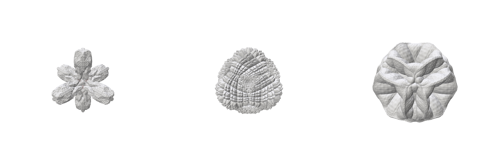
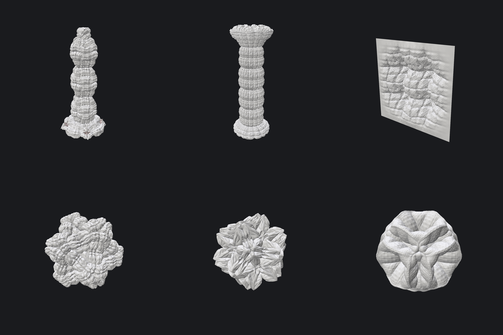
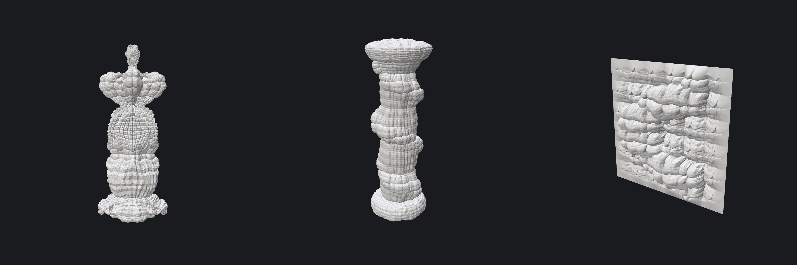
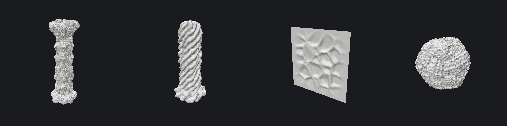
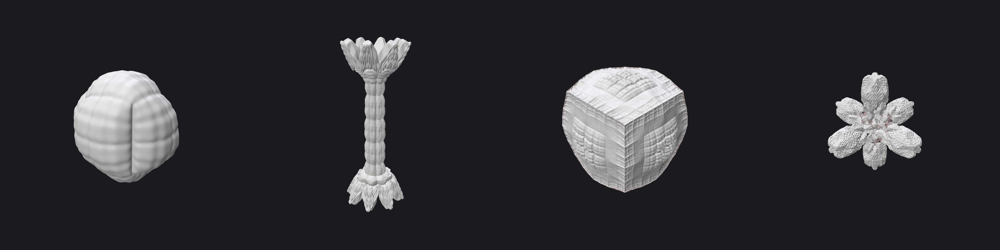
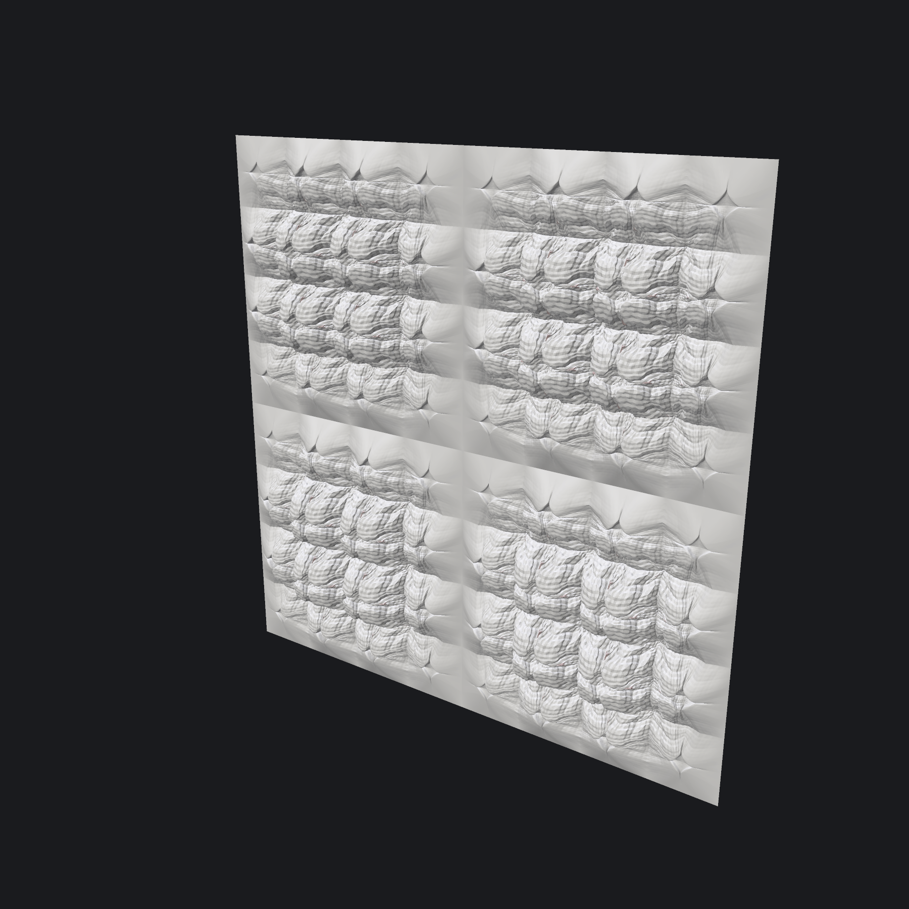

# Subdivision as a Generative System

An interactive engine for **Michael Hansmeyer's extended Catmull-Clark / Doo-Sabin subdivision**
(*From Mesh to Ornament*, eCAADe 2010), the method behind his Subdivided Columns and
Digital Grotesque (with Benjamin Dillenburger).

- Background research: [`info.md`](info.md)
- Agreed plan and milestones: [`PLAN.md`](PLAN.md)


*Our Fig. 3 presets (cube, 8 iterations, non-stationary weights). Left: six arms. Centre: corner cup with a spike field. Right: Catmull-Clark + Doo-Sabin flower.*


*Milestone 2 presets: Fig. 4 box column, Fig. 7 classic column, grotto panel, dodecahedron coral, icosahedron crystal, Fig. 3 right.*


*Milestone 3, attractors. Left: paper Fig. 4, four weight sets along y give a base and three sections. Middle: a helix curve wraps the column in a spiral of ornament. Right: a sine-curve "river" across a tileable panel.*


*Milestone 4, function layers: gyroid coral column, twisted rose flutes, Worley cell tile, Mandelbox-folded gyroid.*


*Milestone 5, the paper's intrinsic features. Fig. 9 locked edges (sharp creases), Fig. 7 motif-driven column, Fig. 8 topological distance, porosity by vertex merging.*

## Run it

| | First run (installs everything into a local `.venv`) | Afterwards |
|---|---|---|
| **Mac** | double-click `run_mac.command` | same |
| **Windows** | double-click `run_windows.bat` | same |

Requirements: **Python 3.10+** ([python.org](https://www.python.org/downloads/); on Windows tick *"Add python.exe to PATH"*).

- macOS may block the file the first time: right-click → *Open*, or run `chmod +x run_mac.command` in a terminal.
- Manual alternative (both OSes): create a venv, `pip install -r requirements.txt`, `python app.py`.

## Using the app

- **Theme** (top of the panel): *Dark* is the default; *Light* is available. Your choice is remembered in `.app_settings.json`.
- **Preset**: load any design from `presets/`. Type a name and press *Save* to store your own.
- **Base mesh**: pick a shape; its parameters appear as sliders.
  - Cube and Platonic solids (tetrahedron, octahedron, dodecahedron, icosahedron).
  - **Column: box on base** (paper Fig. 4) and **Column: classic** (Fig. 7 style: base, shaft with entasis and taper, echinus, abacus).
  - **Panel**: an open relief tile with optional bend or saddle.
  - **Cube cage (frame)**: the 12 edges of a cube as bars, all six faces open.
  - **Sphere with opening (vessel)**: a sphere with a circular opening on top. *opening* is its angular radius.
  - **Import OBJ**: drop `.obj` files into `inputs/` (a sample `l_block.obj` is included), pick one and press *Load OBJ*. Duplicate vertices are welded, winding is repaired, and the mesh is scaled to fit. Non-manifold meshes are rejected with an explanation.
- **Boundary** (open meshes only):
  - *smooth* uses the standard Catmull-Clark boundary rules.
  - *locked / tileable* keeps the outline fixed and fades the relief out over *fade rows*, so identical tiles meet seamlessly (see below). Doo-Sabin steps shrink open boundaries, and the app warns when they'd break tiling.
- **Depth & extrusion**: *preview depth* recomputes live while you drag. After 1.5 s idle (or *Bake full depth*), the **full depth** is computed. The face budget caps runaway depths.
- **Iteration schedule**: pick an iteration, choose Catmull-Clark or Doo-Sabin, and set its weights. *Sharp* sets `w1=-1, w2=-2`; *Copy → next / all* duplicates a step. *Overview* shows every weight as bars across iterations.
- **View & export**: *diagonal* looks down the cube's body diagonal like the paper. Export **OBJ / PLY** (quads kept) or **STL** (triangulated) to `exports/`; *Screenshot* writes to `renders/`.
- **Section view (see inside)**: *cut the view open* hides everything on one side of a plane, so you can keep editing while looking inside.
  - Pick the plane (*X / Y / Z*), slide its *position*, or *Flip* to keep the other half.
  - *drag in the view* shows a handle to move or tilt the plane with the mouse.
  - *Face the cut* points the camera at the cut face.
  - It works on the form and on the print model, and screenshots and turntables are cut too.
- Ctrl+click any slider to type an exact value. Hover a control for its explanation.
- Pinkish surfaces are **back faces**: the surface has folded through itself.

### Attractors (non-uniform weights)

Attractors make weights vary **in space**, the paper's *extrinsic specification of parameters* (eq. 8–9). Use the **Attractors** panel:

- **+ Point / + Curve** adds one near the form. Click a row to select it. **Drag the white gizmo** in the viewport, or type coordinates.
- **Kind**:
  - *point*.
  - *curve*: line, circle, helix, sine, Lissajous, or an editable **polyline**. *Convert to editable polyline* turns any curve into draggable control points. *Import* reads `.csv/.txt` (x y z per line) or `.obj` polylines from Rhino or Blender; try `inputs/sample_curve.csv`.
- **Payload**:
  - *weight set*: a full per-iteration schedule of its own. Each face blends all sets by distance: `c_a = f(d_a)·h_a / Σ f(d_i)·h_i`, `w = Σ w_i·c_i` (eq. 8–9).
  - *modifier*: rules such as "scale `w_f` ×3 in iterations 1–4" or "add +0.3 to `w_e`", applied near the attractor.
- **strength** (`h`), **radius**, and **falloff**: `power` is the paper's `(1−d)^t`; also linear, smoothstep, gaussian, or a hand-drawn **spline** (5 sliders). The plot shows the curve.
- **background**: how much the main schedule takes part in the blend. **0 is paper-pure.** With 0, a *single* set applies fully everywhere it reaches, so use background > 0 for a gradient.
- **Measure at**:
  - *current* uses distance from where a face is now, so growth reacts to its own movement.
  - *original* uses where the face sat on the input mesh, which gives stable zoning.
- **influence map** colours the form by the selected attractor's influence.

### Function layers (our extension)

Mathematical fields and folds layered on top of Hansmeyer's process, in the **Function layers** panel:

- **+ Weight field**: a field drives one weight per face (`w_f`, `w_e`, …) before an iteration. The blend can be add, multiply, replace, min or max.
- **+ Displacement**: moves vertices along their normals after an iteration (adds relief directly).
- **+ Fold**: deforms the whole mesh with a fold map after an iteration.
- **Built-in families:**
  - **TPMS**: gyroid, Schwarz P, Schwarz D, Neovius.
  - **Noise**: Perlin, fBm, ridged, domain-warped, Worley cells or borders.
  - **Analytic**: constant (with a mask, a plain weight or relief boost just where the mask is), spherical harmonics, superformula, superquadric, k-fold rose with twist.
  - **Folds**: box, sphere, kaleidoscopic mirror, Mandelbox step, clamp to box (flat, cut-like outer faces).
- **Per layer:**
  - amplitude and offset.
  - iteration range.
  - **evaluate at** *original* positions (the pattern sticks to the form like a texture) or *current* positions (the form grows through a fixed pattern).
  - **mask** by an attractor's reach, or by **facing direction** (*facing +y* etc.): the layer acts on surfaces facing that way and fades out on surfaces facing away. *facing +y* keeps detail on top and leaves the undersides plain, which is easier to 3D print.
  - **domain fold**: repeat a fold on the field's input, e.g. Mandelbox × 3 with c = 1, for fractal ornament.
- **Plug-ins**: drop a `.py` file into `functions/` with an `@field` or `@fold` function, then press *Reload plug-ins*. Sliders are generated from its parameters. See [`functions/README.md`](functions/README.md) and the examples `ripples.py` and `twist.py`.

### The paper's intrinsic features

- **Groups (Fig. 9)**: *+ Group*, then *Click to tag* faces or vertices on the input mesh, or *Select by rule* (facing direction, height band, every k-th, motif).
  - Each group gets **weight rules**.
  - **Lock iterations** hold its vertices in place, so locked edges stay sharp creases and locked points become spikes. Tags pass to every child face.
- **Motifs (Fig. 6–7, eq. 10–11)**: every motif found on the input (e.g. `3F3E`, `4F4E`) gets an attractor/deflector value **U**. The schedule's **w6** and **w7** pull face and edge points toward (+) or away from (−) those vertices.
- **Measure rules (Fig. 8 + curvature)**: distance to original vertices, distance to original edges, planarity, or bend gives a per-face *t* in [0, 1]. A rule sets, scales or offsets a weight from *at 0* to *at 1*.
- **Vertex merging / porosity**: welds vertices of *different* parts of the surface that grow into contact (pairwise, within a fraction of the local edge length). Where a welded vertex would exceed the **max valence**, faces aren't formed, which opens holes and handles. The Euler characteristic is shown.
- **Colour by** (View & export): attractor influence, the selected layer's field, group tags, or any measure. It shows where things act.

### Printing (FDM) and turntables

**Print (FDM, watertight STL)** turns any form into a printable solid:
- **What it handles:**
  - Self-intersections are merged into one solid.
  - Open or porous skins are thickened to the *min wall*.
  - Reliefs can get a *solid base*.
- **What you get:** the model is placed on the build plate in **millimetres, Z up**. Features thinner than about 2 nozzle widths are shown in **red**.
- **Accuracy:** within a fraction of a voxel of the requested size; volume within about 2%.
- **Runs in a separate process,** so the app stays responsive. Big models can't crash it, and an out-of-memory failure shows up as a message.
- **Exports are safe:**
  - Free disk space is checked first.
  - Data goes to a temporary file that only replaces the target once complete.
  - The written STL is **re-read and verified** to be complete and watertight before you see "verified".
- ***Mesh detail: half*** gives about 4× smaller files (still watertight).
- **Typical times:** 100 mm at 0.3 mm voxels takes about 2–20 s; 200 mm about 1.5 min and 2 GB of RAM.

The panel is laid out top to bottom:
- **Printer:** pick your bed (Bambu A1/P1S/X1C, A1 mini, Prusa MK4, CORE One, MINI, or custom). The choice is remembered.
- **Size:** choose what the number measures (longest side, height, width or depth), type it in mm or click 50/100/150/200. **Fit bed** finds the largest size that fits. The live W × D × H line says whether it fits.
- **Orientation:** which model axis points up (±X, ±Y, ±Z). **Auto** picks the one with the least overhang.
- **Undersides:**
  - **Self-supporting undersides** fills below every overhang with a smooth keel no flatter than the angle (default 45°). The print then needs almost no support.
    - Upward-facing surfaces keep all their detail, and horizontal holes get pointed (teardrop) tops.
    - It adds material, sometimes doubling the volume of forms with large overhangs.
    - Set the slicer's threshold angle below the keel angle.
  - **Flat foot** trims the bottom flat, so the print stands on a face instead of a point.
- **Cut into parts:** *Whole*, *2 halves* (a horizontal cut at the widest section), *4 quarters* (two vertical cuts: four pillars, like the corners of a cage) or *8 pieces*. You can also tick each cut and move it.
  - Orange planes on the form show where the cuts go.
  - Every part is its own closed solid, and its cut faces are exactly flat, so mating parts meet without a gap.
  - *Alignment pin holes* (default Ø 2.0 mm × 5 mm, for 1.75 mm filament pins) are drilled into both faces of every joint.
  - Each part is turned on its own to need the least support (usually cut face down), or printed as assembled.
- **Resolution:** *Draft / Standard / Fine* (voxel = 1 / 0.75 / 0.5 × nozzle) or *Max* (the finest the grid limit allows). The line below shows the real detail size, triangles, STL size, RAM and time. If the grid limit coarsens your choice, it says so.
- **Advanced:** exact voxel size, grid limit (400–1000 voxels along the longest side, with its RAM cost), min wall, smoothing, voxel softening, mesh detail and solid base.
- **Support check** (after preparing): set the slicer's support *threshold angle*. Surfaces that would get support turn red, and the area per part is listed.
  - The angle works like Bambu Studio, Orca and PrusaSlicer: downward surfaces flatter than it (measured from the horizontal) get support, so **higher = more support**.
- **View:** *Print layout* (parts side by side on the plate) or *Assembled*, with an explode gap. Colour by *needs support*, *too thin* or *parts*.
- **Export print STLs** writes one verified STL per part (`…_part1of4_left-front.stl`, …). Load them all into the slicer together.

**Cube cage** (`presets/cube_cage.json`): a cube frame with flat outer faces and organic openings, printed in 4 quarters.
- It starts from the **Cube cage (frame)** base shape: 12 bars, all six faces open. *bar width* and *segments* are in the Base mesh panel.
- Subdivision makes the bars swell, ridge and bead.
  - fBm noise and three *lens* attractors make some bars bulge into the openings while others stay slim.
  - Worley cells texture the inside.
- A final **Clamp to box** fold flattens everything beyond the cube onto its faces, so the outer faces are flat like a cut block.
- To print it: *Cut into parts → 4 quarters*. Each quarter lies flat on an outer face, needs almost no support, and has pin holes at the joints, so the cage can be assembled around something placed inside.
  - At 150 mm it is about 620 cm³ (≈370 g PLA at 20% infill). A smaller *bar width* or size makes it lighter.

**Why a whole Fig. 3 form gets support everywhere:** its arms stick out sideways, so their undersides are near-horizontal overhangs at any threshold angle. The form also stands on a single arm tip.
- The mesh is fine: shrink-wrapping it changes nothing.
- Cutting it into 2 halves at the widest section cuts the support area by about 4–7×, and each half stands on a large flat face.

**Turntable** orbits the camera around the form, or around the print model, and saves a GIF or MP4 to `renders/`. From the command line:

```bash
python render.py presets/fig3_right.json --turntable renders/fig3_right.gif
```

If anything unexpected goes wrong, the app logs it to `app_errors.log` and shows it in the panel instead of closing.


*Four copies of `panel_tile` side by side: the locked boundary makes the seams line up.*

### Vessel: lithophane sphere

The **Vessel (lithophane sphere)** panel turns the form into the inside of a thin shell (our extension):
- **Outside**: an exact, smooth sphere of the chosen *diameter (mm)*.
- **Inside**: the subdivision relief.
  - Where the relief rises, the wall is thin (*thinnest wall*) and glows when lit from inside.
  - Where it sinks, the wall is thick (*thickest wall*) and dark.
- **Opening**: an exact, flat circle with a solid *rim wall*. The vessel prints upside down standing on it, so the dome comes out smooth.
- **Tuning the light pattern**:
  - *contrast*: how much of the relief's range spreads over the wall band.
  - *relief scale*: how large a shape still counts as relief.
  - *invert light*: swap bright and dark.
- **Light preview** (or *Colour by → light through the wall*): bright = thin. Use the **Section view** to see the relief itself.
- **Printing**: the Print panel exports the vessel **exactly**, with no voxel remesh, so the sphere stays perfect. It is set upside down (*-Y up*) and sized by the vessel's diameter.
  - An opening of 35° or more needs no support outside.
- **Preset**: `presets/lithophane_sphere.json`. A Doo-Sabin step, fBm-varied extrusions and a Worley vein network give a glowing vein pattern over dark cells. At 120 mm it is about 95 g of PLA and a 32 MB STL.

### Weight cheat-sheet (relative extrusion: 1.0 = one local edge length)

| Weight | Equation | Effect |
|---|---|---|
| `w_f` | 1 | push face centres out (+) / in (−) → bumps, spikes, pits |
| `w_e` | 2 | push edge points along the edge normal → ridges, ribs, rims |
| `w_c` | 3 | push corner points along the vertex normal. **Strongly negative pulls corners in → arms / cups** |
| `w1` | 2 | edge point bias: −1 = plain edge midpoint (no smoothing) |
| `w2` | 3 | corner bias: negative = anti-smoothing. **`w1=-1, w2=-2` keeps forms crisp** |
| `w3`, `w4` | 4 | from iteration 2: face-point bias toward the old corner/face vertex (`w3`) and diagonal/edge vertices (`w4`). `w3=-1, w4=1` concentrates growth on the previous step's tips |
| DS `w1`, `w_f` | 5–6 | Doo-Sabin corner pull and extrusion, set separately for face-, edge- and vertex-derived faces |

**Lesson from tuning:** with standard smoothing (`w1 = w2 = 0`), whatever the extrusions build gets averaged away in later steps. Switch smoothing off (*Sharp*) and the extrusions accumulate.

## Render presets from the command line

```bash
python render.py presets/fig3_left.json --depth 8                 # → renders/fig3_left.png
python render.py presets/*.json --depth 6 --montage renders/all.png
python render.py presets/panel_tile.json --theme light            # white background
```

## Tests

```bash
pip install -r requirements-dev.txt
python -m pytest
```

The suite checks:
- Zero weights reproduce textbook Catmull-Clark and Doo-Sabin, compared against an independent loop-based reference (`tests/reference.py`). This covers closed and open meshes and mixed CC/DS.
- The paper's eq. 2, 3, 4, 5 and 6 numerically.
- Face counts, Euler characteristic and manifold orientation.
- That every base shape is a valid, outward-facing solid, and that the Platonic solids are regular.
- **Locked panels are tileable**: the outline stays fixed and opposite edges match. The boundary fade is checked too.
- OBJ parsing (all index syntaxes), welding, orientation repair, non-manifold rejection, and OBJ/STL/PLY writers.
- **Attractors**:
  - eq. 8–9 blending as a partition of unity, plus background blending and modifiers by iteration range.
  - Falloff shapes, curve geometry, curve distance (exact and fast, with a tested error bound) and polyline import.
  - Rest vs current positions.
  - Per-iteration cache invalidation: editing iteration k recomputes only from k.
- **Function layers**:
  - Every built-in field and fold is bounded, finite and deterministic. The gyroid formula, Perlin continuity, Worley F1 ≤ F2, kaleidoscope wedges and SH symmetry are checked.
  - The five blend modes, iteration ranges, attractor masks, displacement and fold amounts, and per-level caching.
  - Plug-in loading, errors and reloading.
- **Intrinsic features**:
  - Motif labels (CC adds exactly `4F4E`).
  - eq. 10 and 11 numerically.
  - Topological distances (Fig. 8), planarity and bend.
  - Rules, tag inheritance through CC and DS, rule-based selection.
  - **Locked edges stay straight creases** (Fig. 9) and release after L iterations.
- **Merging**: pairwise only; topological neighbours are never welded; the max valence opens holes; the result stays manifold and can be subdivided further.
- **Printing**:
  - Closed, watertight output for self-intersecting, open, porous and relief forms, at full and half detail.
  - Requested size and wall thickness are kept.
  - Thin features are flagged, the up-axis rotation is correct, and the voxel cap applies.
  - The STL validator catches truncated and holed files.
  - Up rotations are proper (never mirrored), size can be set along any axis, and *Auto* stands a column up.
  - Halves are closed and stand on a flat cut face. They need much less support than the whole.
  - Quarter joints meet exactly, explode correctly, and never overlap in the print layout.
  - Pin holes have the requested volume and keep each part a single solid. Per-part STLs verify.
  - The support threshold angle follows slicer conventions (higher = more support).
  - Self-supporting undersides keep every layer within the slicer's angle of the one below and only ever add material. The flat foot is flat.
  - *facing +y* masks leave downward-facing vertices untouched.
  - The cage base is a closed genus-5 frame, and *clamp to box* flattens the outside.
  - The cube cage preset prints as 4 single-piece quarters, each lying on a flat face.
  - **Vessel**:
    - The open sphere base has one circular opening.
    - The vessel is a closed, outward-oriented shell: exact sphere outside, walls within the requested band, a flat rim.
    - Thinner walls light up brighter, and presets round-trip.
    - The exact print stands on its rim, verifies watertight, and needs almost no support.
  - A full disk is refused cleanly (no partial file), writes are atomic, and the worker process runs.
- **Turntable**: GIF frames orbit (skipped without OpenGL).
- Affine and scale invariance, caching, the face budget, JSON round-trips, and that every preset loads.

## Layout

```
app.py              interactive Polyscope app
ui_attractors.py    Attractors panel (gizmo, curves, falloff, sets, modifiers)
ui_layers.py        Function layers panel
ui_intrinsic.py     Groups / motifs / measures / merging panels (click-to-tag picking)
ui_print.py         Print (FDM) and Turntable panels
ui_vessel.py        Vessel (lithophane sphere) panel
ui_section.py       Section view (cutting plane)
ui_common.py        shared UI widgets
render.py           headless preset → PNG
hansmeyer/
  mesh.py           polygon mesh, vectorised half-edges, normals, per-vertex attributes
  catmull_clark.py  extended CC (eq. 1–4), smooth / locked boundaries
  doo_sabin.py      extended DS (eq. 5–6)
  schedule.py       weight definitions, per-iteration schedule, Design (= preset JSON)
  pipeline.py       runs a Design: caching, face budget, boundary fade
  shapes.py         base mesh registry (Platonic solids, columns, panel, cage, open sphere, OBJ)
  attractors.py     eq. 8-9 weight sets, modifiers, falloffs, curves, distances
  functions.py      field / fold registry, built-ins, plug-in loader (@field, @fold)
  noise.py          vectorised Perlin, fBm, ridged, warped, Worley
  layers.py         function layer stack (weights, displacement, folds)
  intrinsic.py      groups & locks, motifs (eq. 10-11), measures & rules
  merge.py          vertex merging / porosity
  printprep.py      watertight voxel remesh for FDM printing (+ thin-feature check), exact export for vessels
  vessel.py         thin-walled lithophane sphere: exact outer sphere, relief inside, flat rim
  meshio.py         OBJ import + cleanup; OBJ / STL / PLY export
  view.py           shared rendering style and dark/light themes
presets/            JSON designs
functions/          your plug-in functions (examples included)
inputs/             drop .obj meshes / curve files here (samples included)
tests/              pytest suite + independent reference implementation
```

## Faithfulness to the paper

- **From the paper:**
  - eq. 1–6, non-stationary weights, the CC + DS combination, and provenance (corner/edge/face points; face/edge/vertex-derived faces).
  - The Fig. 4 / Fig. 7 column inputs.
  - **eq. 8–9 extrinsic weight sets** (Fig. 4 zoning, Fig. 5 planar or spatial sets).
  - **Intrinsic parameters:** topological motifs with attractor/deflector values (**eq. 10–11**), topological distance (**Fig. 8**), planarity, tagging and **locking** (**Fig. 9**).
  - **Vertex merging with a maximum valence** (porosity).
- **Our extensions (labelled in code):**
  - Eq. 1/3 applied to n-gons and any valence.
  - A Doo-Sabin `w1` generalisation for n ≠ 3, 4.
  - Relative extrusion (the paper doesn't say whether normals are unit length; the *absolute* mode is the literal reading).
  - Boundary rules and the locked/tileable mode for open meshes.
  - Attractors:
    - A radius and choice of falloff (the paper normalises distance by the largest possible distance).
    - Curve attractors.
    - Modifier attractors.
    - The background set.
    - The current/original measuring position.
  - The whole function layer stack (TPMS, noise, analytic fields, folds, plug-ins).
  - The bend measure.
  - Merging details. The paper only says proximate vertices are joined and faces can't form beyond the max valence. We weld *pairs* of vertices that don't share a face, within a fraction of the local edge length, and drop the faces that would break manifoldness.
- **Fig. 3:** the paper publishes no weight values, so the presets reproduce the *character* of the figures, not exact geometry. The left figure's arms are there, but its fluted fans at the arm tips aren't yet.
- **Fig. 4:** reproduced in character by `column_fig4_zoned`: four weight sets along y, a base and three sections with gradients. Again, the paper gives no weight values.

## Roadmap

1. ✅ Core engine, tests, minimal viewer, Fig. 3 presets
2. ✅ Dark/light theme, Platonic solids, columns (Fig. 4/7), open panel with smooth/locked boundaries, OBJ import, OBJ/STL/PLY export, schedule overview
3. ✅ Attractors (points and space curves, falloff curves, weight sets and modifiers, gizmo dragging, influence map)
4. ✅ Function layer stack (TPMS, noise, analytic, folds, domain folds) and a `functions/` plug-in folder
5. ✅ Tagging/locking (Fig. 9), motifs (eq. 10–11, Fig. 7), topological distance (Fig. 8) and curvature, vertex merging (porosity), colour-by maps
6. ✅ Watertight voxel remesh for FDM printing (verified STL export, thin-feature check), turntable GIF/MP4
